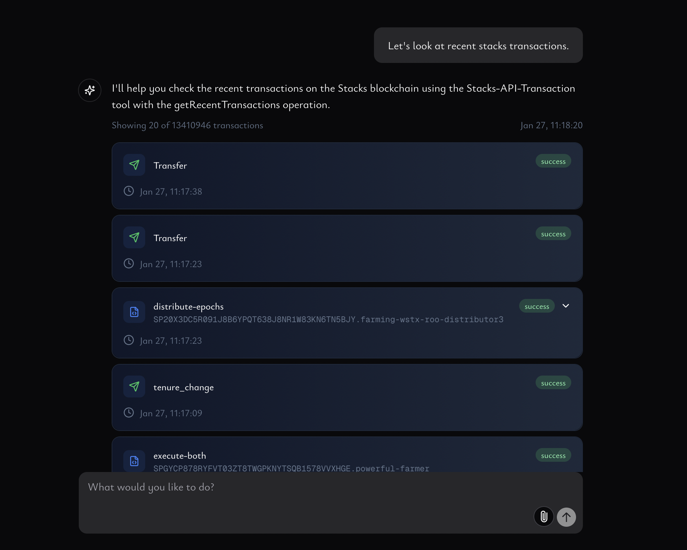

# Charisma Explore

An AI-powered blockchain explorer and interaction platform built with Next.js 14 and the Vercel AI SDK.

## Overview

Charisma Explore is a comprehensive tool for exploring the Stacks blockchain, monitoring transactions, and interacting with smart contracts. The platform combines modern web technologies with AI assistance to provide:

- Real-time blockchain monitoring and analysis
- Smart contract interaction and auditing
- Token registry management and tracking
- Transaction analytics and mempool inspection
- AI-assisted blockchain exploration

## Preview



Experience Stacks blockchain exploration with an intuitive, AI-powered interface that makes complex blockchain interactions accessible and efficient.

## Key Features

- **AI Assistant**: Powered by Claude 3 and GPT-4 models for intelligent blockchain interaction
- **Real-time Updates**: Monitor transactions and blockchain activity in real-time
- **Smart Contract Tools**: Analyze, audit, and interact with Stacks smart contracts
- **Token Management**: Track and manage SIP-010 tokens with detailed analytics
- **Authentication**: Secure user authentication with NextAuth.js
- **Modern UI**: Built with Tailwind CSS and shadcn/ui components

## Getting Started

### Prerequisites

- Node.js 18+
- pnpm (recommended) or npm
- PostgreSQL database
- Vercel account (for deployment)

### Environment Variables

Create a `.env.local` file with the following required variables:

```bash
# Authentication
AUTH_SECRET="your-auth-secret"  # Required for NextAuth.js

# Database
POSTGRES_URL="postgresql://..."  # Your PostgreSQL connection string

# AI Models
OPENAI_API_KEY="sk-..."         # For GPT-4 models
ANTHROPIC_API_KEY="sk-..."      # For Claude models

# Vercel KV (for caching)
KV_REST_API_URL="..."
KV_REST_API_TOKEN="..."

# Optional: Analytics
VERCEL_ANALYTICS="true"
```

### Installation

1. Clone the repository:
```bash
git clone https://github.com/your-username/charisma-explore.git
cd charisma-explore
```

2. Install dependencies:
```bash
pnpm install
```

3. Set up the database:
```bash
pnpm db:generate
pnpm db:push
```

4. Start the development server:
```bash
pnpm dev
```

The application will be available at `http://localhost:3000`.

## Development Tools

- **Database Management**:
  - `pnpm db:studio`: Launch Drizzle Studio for database management
  - `pnpm db:generate`: Generate database migrations
  - `pnpm db:push`: Apply database migrations

- **Testing**:
  - `pnpm test`: Run tests
  - `pnpm test:ui`: Run tests with UI
  - `pnpm test:coverage`: Generate test coverage report

## License

Licensed under the Apache License, Version 2.0. See [LICENSE](LICENSE) for details.
